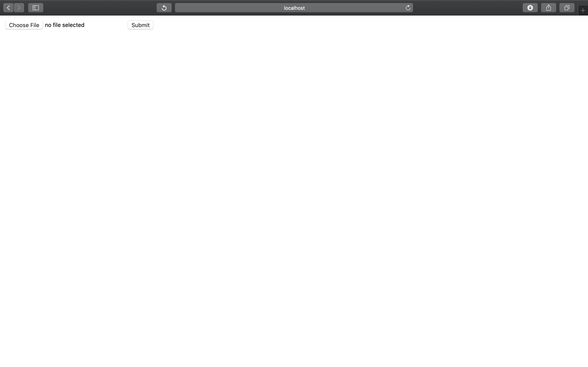
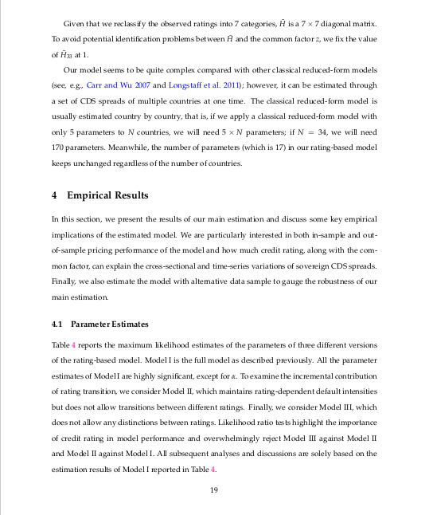
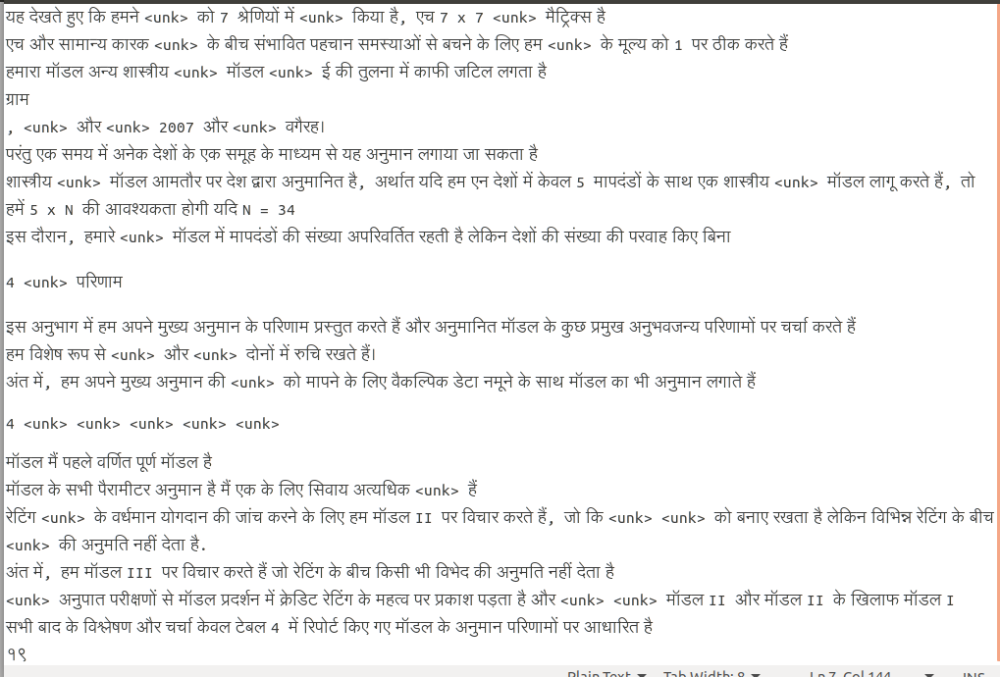

# Digital-Document-Translater
This repository contains the code to convert English Digital Documents(pdf) into Hindi. 

## Requirements

    1. Python 3.7
    2. pip 19.0.3
    3. OS : ubuntu18.** , ununtu16.**


1. **Installing Dependencies**
    ```bash
    pip install -r requirements.txt
    sudo apt-get install tesseract-ocr
    sudo apt install libtesseract-dev 
    sudo apt-get install libleptonica-dev
    ```
    Please feel free to refer to
    [tesseract installation](https://github.com/tesseract-ocr/tesseract/wiki/Compiling)
    page for any help in installation
    .
2. **Model Download**: 

    Download model from
    [here](https://github.com/srijan14/Machine-Translation-Models/tree/master/eng-hin/v1)
    and copy inside the **./model** folder . Update the model path in src/constants.py file, 
    if having some different model name.
    
3. **Start Server** (will start a server on port 5001)
    ```bash
    python src/app.py
    ```
4. Go to http://localhost:5001/home
    
    


5. Example Run 
    
    a. English - Hindi 
    
    Input Upload(English)            |  Hindi Output
    :-------------------------:|:-------------------------:
      |  

**Note: Having too many pages in the pdf might take a bit of time for
the API to return the results. On successfull processing, a text file
with the converted hindi text will be generated.**

## Acknowlegements
1. [text-translator](https://github.com/srijan14/text-translator)

## Future Work
1. Updating Web UI to allow the user to translate an image format documents, and also the functionality to allow the conversion of a particular page of pdf.
2. Support for Other Languages.


