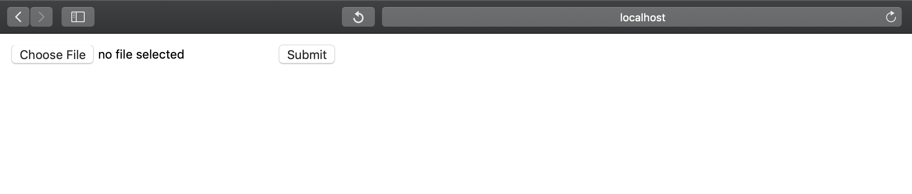

# English-Hindi-Digital-Document-Translater
This repository contains the code to convert English Digital Documents(pdf) into Hindi. 

## Requirements

1. Python 3.7
2. pip 19.0.3
3. OS : ubuntu18.**

Below are the two components present :

### 1. **Machine-Translation**

We have used [opennmt](https://github.com/OpenNMT/OpenNMT-py) to train
and serve the model trained on our own custom dataset along with this
[open source](http://www.cfilt.iitb.ac.in/iitb_parallel/) dataset. Follow below instructions to start this
component server:

1. **Installing Dependencies**
    ```bash
    cd OpenNMT-py && pip install -r requirements.txt --no-cache-dir
    ```
2. **Model Download**: 

    Download model from [here](https://github.com/srijan14/Machine-Translation-Models/tree/master/eng-hin/v1) and copy inside the
    ./OpenNMT-py/available_models folder
   
3. **Start Server**(Will start a server at default port **5000**)
    ```bash
    bash run_server.sh
    ```
    Below is a sample curl request to test the results:
    
    ```bash
     curl --header "Content-Type: application/json"   --request POST   --data '[{"id":100,"src":"You should refrain from doing this."}]' http://localhost:5000/translator/translate
    ```
    Tools like postman etc can also be used to test the api.

### 2. **PDF to Converted(Hindi) Text**

1. **Installing Dependencies**
    ```bash
    pip install -r requirements.txt
    sudo apt-get install tesseract-ocr
    sudo apt install libtesseract-dev 
    sudo apt-get install libleptonica-dev
    ```
    Please feel free to refer to
    [tesseract installation](https://github.com/tesseract-ocr/tesseract/wiki/Compiling)
    page for any help in installation.
2. **Start Server** (will start a server on port 5001)
    ```bash
    python src/app.py
    ```
3. Go to http://localhost:5001/home
    <center style="padding: 40px"></center>

    **Note: Having too many pages in the pdf might take a bit of time for
the API to return the results. On successfull processing, a text file
with the converted hindi text will be generated.**

## Future Work
1. Updating Web UI to allow the user to translate an image format documents, and also the functionality to allow the conversion of a particular page of pdf.
2. Support for Other Languages.
